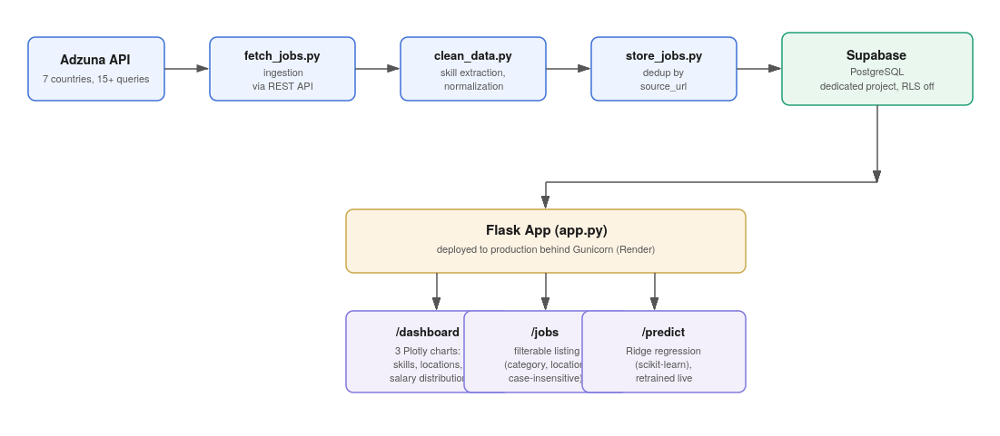
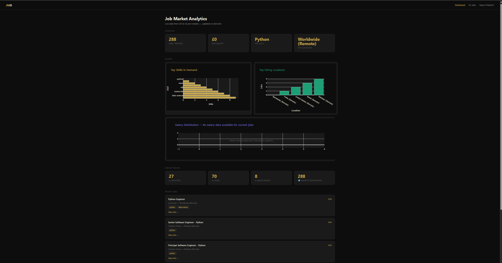
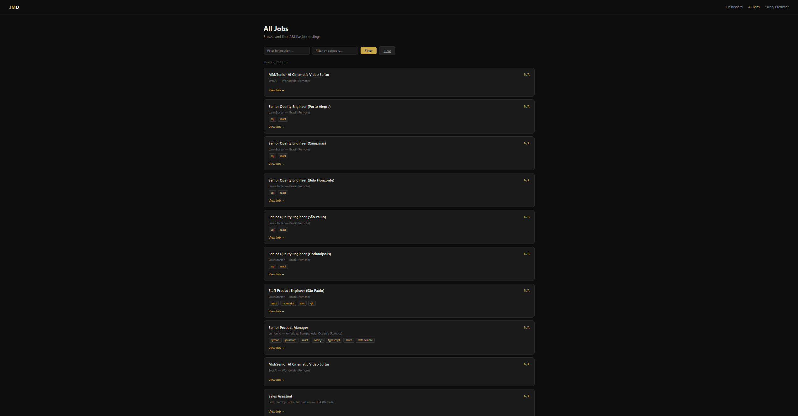

# Job Market Dashboard

End-to-end job market intelligence platform: ingests live job postings, cleans and structures
them, stores them in a production database, and serves both analytics and a live salary
prediction model through a Flask web app.

**Live app:** https://job-market-dashboard-ton7.onrender.com/

---

## Problem Statement

Job postings are unstructured, scattered across sources, and don't tell you what a given skill
set is actually worth in the current market. This project answers a concrete question: given a
set of skills and a location, what salary should you expect — based on real, current postings,
not a static dataset.

## Solution

A pipeline that pulls live postings via the Adzuna API, cleans and normalizes them, extracts
structured skill data from unstructured text, stores everything in Postgres, and serves both an
analytics dashboard and an interactive salary predictor trained on the current data.

## Architecture



- **Ingestion**: `scraper/fetch_jobs.py` calls the Adzuna REST API across 7 countries and 15+
  role/location query combinations.
- **Cleaning**: `scraper/clean_data.py` extracts skills from raw job descriptions by matching
  against a 32-skill taxonomy, and normalizes salary and location fields.
- **Storage**: `scraper/store_jobs.py` writes to a dedicated Supabase (PostgreSQL) project,
  deduplicating on `source_url` before insert. Row-Level Security is deliberately disabled,
  since the dataset is public job-market data with no per-user access requirement.
- **Serving**: `app.py` is a Flask application with three routes — a dashboard, a filterable
  job listing page, and an interactive salary predictor.

## Tech Stack

Python, Flask, Supabase (PostgreSQL), scikit-learn, Pandas, Plotly, Adzuna API, Gunicorn, Render

## Features

- Live data ingestion from a real jobs API, not a static/Kaggle dataset
- Skill extraction from unstructured text against a defined taxonomy
- Server-side aggregate analytics (top skills, top locations, average salary)
- Three interactive Plotly visualizations (skill demand, hiring locations, salary distribution)
- Filterable job listings page (server-side, case-insensitive filtering by category/location)
- Ridge regression salary predictor (scikit-learn), retrained live from current database
  contents on each run, served through an interactive form
- Deployed to production behind Gunicorn

## Screenshots





## Installation

```bash
git clone https://github.com/Shakir-Raza/job-market-dashboard.git
cd job-market-dashboard
python -m venv venv
source venv/bin/activate      # Windows: venv\Scripts\activate
pip install -r requirements.txt
```

You'll need your own Supabase and Adzuna API credentials set up locally to run this (not
included here for security reasons).

## Usage

```bash
# Run the scraper to populate the database
python scraper/fetch_jobs.py

# Run the Flask app
python app.py
```

Visit `http://localhost:5000` to view the dashboard.

## Future Improvements

- Add scheduled/automated scraping (e.g. via a cron job or GitHub Actions) instead of manual runs
- Expand the skill taxonomy beyond 32 keyword-matched terms to a proper NLP-based extraction
- Add caching for the analytics queries to reduce redundant computation on each dashboard load
- Add tests for the cleaning and dedup logic

