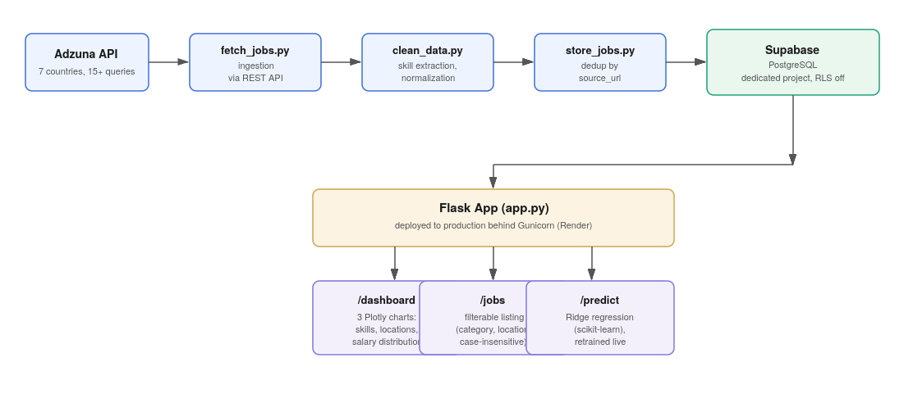

# Job Market Dashboard

End-to-end job market intelligence: live postings from multiple sources, cleaned and stored in Postgres, served as analytics and a salary predictor through a Flask app.

**Live app:** https://job-market-dashboard-ton7.onrender.com/

---

## Problem

Job postings are scattered and unstructured. It's hard to answer: *given these skills and this region, what salary range is realistic right now?*

## Solution

1. Ingest live roles (Adzuna, Himalayas, Remotive, optional Jooble)
2. Normalize fields, extract skills, map locations
3. Store deduplicated rows in Supabase (PostgreSQL)
4. Serve dashboard, listings, and a ridge-regression salary estimate

## Architecture



```
app.py                 # Flask routes only
services/
  db.py                # Supabase client + TTL cache
  cache.py             # In-process cache
  dashboard.py         # Aggregates + Plotly charts
  formatters.py        # Salary display
analytics/ml_model.py  # Ridge salary model
scraper/               # Fetch / clean / store pipeline
```

| Layer | Tech |
|--------|------|
| Ingestion | Adzuna, Himalayas, Remotive, Jooble |
| Cleaning | Pandas, skill taxonomy, location helpers |
| Storage | Supabase (PostgreSQL) |
| App | Flask + Gunicorn |
| Charts | Plotly |
| ML | scikit-learn (Ridge) |
| Deploy | Render |
| CI scrape | GitHub Actions (weekly) |

## Features

- Multi-source live job data
- Dashboard: region, skills, salary charts
- Jobs: search, filters, sort, pagination
- Job detail + original apply link
- Salary predictor with optional region and ±15% range
- Dark / light theme
- Rate limiting + CSRF
- In-process TTL cache for job list / counts
- Health endpoints (`/health`, `/healthz`)

## Local setup

```bash
git clone https://github.com/Shakir-Raza/job-market-dashboard.git
cd job-market-dashboard
python -m venv venv
source venv/bin/activate
pip install -r requirements.txt
cp .env.example .env   # fill keys
python scraper/store_jobs.py
python app.py
```

## Tests

```bash
PYTHONPATH=. pytest tests/ -q
```

## Scheduled scraping

`.github/workflows/scrape.yml` runs weekly (and on manual dispatch).  
Add repository secrets: `SUPABASE_URL`, `SUPABASE_SERVICE_KEY`, `ADZUNA_APP_ID`, `ADZUNA_API_KEY`, optional `JOOBLE_API_KEY`.

## Environment

See `.env.example`:

- `ADZUNA_APP_ID` / `ADZUNA_API_KEY`
- `SUPABASE_URL` / `SUPABASE_KEY` / `SUPABASE_SERVICE_KEY`
- `SECRET_KEY`
- Optional: `JOOBLE_API_KEY`, `CACHE_JOBS_TTL`, `CACHE_COUNT_TTL`

## UI

Restrained product style: neutral surfaces, teal accent, Inter. No glass, particles, or gold gradients.

## Future work

- Stronger NLP skill extraction
- Shared Redis cache for multi-instance deploys
- More predictor features (seniority signals)

## License

Personal / portfolio project.
